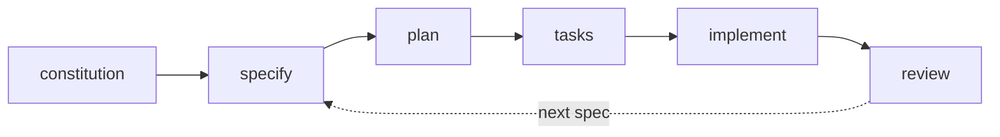

# GitHub Spec Kit

### open-source framework* for structured AI development

✅ **slash commands** for consistent workflows  
✅ **agent-agnostic** - works with any AI assistant  
✅ **six-phase process** from idea to implementation

 

**experimental*
