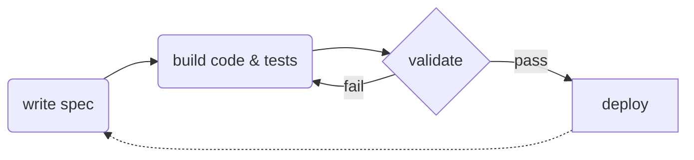

# spec driven development

### 🔄 flipping the script

**traditional:** code first, document later (if ever)

**spec driven:** specifications become **executable** and directly generate implementations

 

